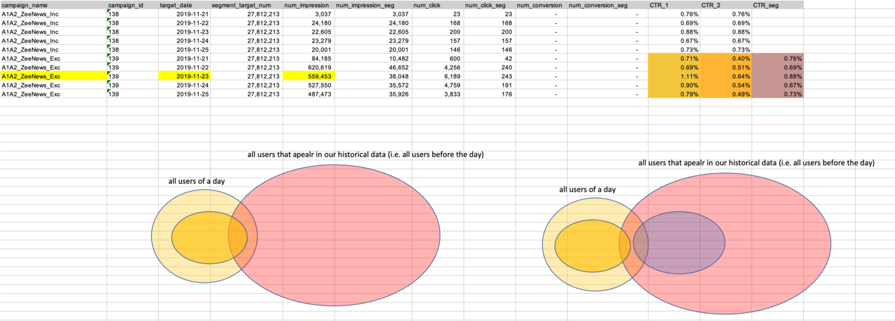

# Hello!
I'm Yu-Chieh Ho (何宇傑), currently working as a senior data scientist in [MoMagic Technologies](https://www.momagic.com/), led the design and development of data monetization products and collaborated with cross-functional stakeholders on end-to-end product optimization (e.g., problem formulation, model building, proof of concept (PoC) and deployment). 

I received my Ph.D. in Computer Science from [National Taiwan University](https://www.ntu.edu.tw/) and developed solid professional skills, especially machine learning and data mining when working with Prof. Jane Yung-jen Hsu in [Intelligent Agents (iAgents) Lab](https://iagentntu.github.io/) and Prof. Thomas S.
Huang in [Image Formation and Processing (IFP) group](https://ifp-uiuc.github.io/), [University of Illinois at Urbana-Champaign](https://illinois.edu/).

# Selected Research Projects
## Learning User Preference from Heterogeneous Data 

_2015 [iAgents Lab](https://iagentntu.github.io/) & [IFP group](https://ifp-uiuc.github.io/)_  
We present DEERS, a deep end-to-end learning framework for recommender systems (RS). 
To fulfill the various recommendation contexts, DEERS integrates collaborative filtering (CF) 
based and content-based recommendation methods into one deep end-to-end neural network to properly 
utilize all available information when modeling user preferences.

DEERS provides modularized interfaces for additional inputs and flexible model structure for various 
recommendation scenarios and heterogeneous inputs. Moreover, it can capture more sophisticated features 
by considering the interaction between source data. We evaluated proposed framework under two different 
real-life scenarios:  individual recommendation and group recommendation on two real-world heterogeneous 
datasets. The experimental results demonstrate that DEERS holds above good properties and its performance 
surpassed the state-of-the-art approaches. 

_Technologies: End-to-End Deep Neural Network, Recommender System, User Modeling_

## Mining Worth-Recommending Items from Long Tails by Modeling Relative Preference

_2014 [iAgents Lab](https://iagentntu.github.io/)_  
we focus on long-tail item promotion and aggregate diversity enhancement, and propose a novel approach 
which diversifies the results of recommender systems by considering “recommendations” as resources to be 
allocated to the items. Our approach increases the quantity and quality of long-tail item recommendations 
by adding more variation into the recommendation and maintains a certain level of accuracy simultaneously. 

The experimental results show that this approach can discover more worth- recommending items from Long Tails and improves user experience.

_Technologies: Recommender System, Data Mining, Machine Learning_

## Cloud-enabled ADL Recognition and Service Inference Technology

_2011 [Intelligent Robot Lab](https://robotlab.csie.ntu.edu.tw/member)_  
Ｗe propose an architecture, in which many health-care applications and services can easily
build upon, for collective long-term ADL pattern analysisvthat leverages several prominent advantages inherent in
cloud computing. The core of the proposed infrastructure includes a module to perform MapReduce-assisted
Bayesian activity recognition based on all collected ADL data. Better yet, the resultant data analysis can be delivered
as a service from a service station which serves as a readily accessible interface to 3rd party service providers and end users. 

_Technologies: Recommender System, Data Mining, Machine Learning_

# Selected Industrial Projects
## Data-Driven Market Segmentation
Built and evaluated machine learning models for Click-Through Rate (CTR), Conversion per Impression (CPI) improvement and Gender Prediction using TensorFlow, Keras and scikit-learn:  

  
_2018-2019, [MoMagic Technologies](https://www.momagic.com/)_

- Distribution based App-Category model:  
Generate segments by analyzing App-installing distribution within each App-Category. Positive results from 3 (out of 4) on-line tests. The CPI (Conversion per Impression) of provided segments surpassed generic users by 40%-500%.

- 2-Winged Deep Neural Network based Segment Recommender:  
Generate customized segments for each campaign by extracting low-rank user / campaign representations using deep neural networks. Positive results from 2 (out of 2) off-line tests. The segment CPI surpassed original human targeting by 31%-34% and more importantly, it kept more than 90% net_installs.

- Model Incubator:  
  Integrate the training and prediction processes into Apache Airflow dags and deployed on Google Cloud Platform.

_Technologies: Deep Learning, Statistical Analysis, Service Automation_

******

## Machine Learning Enabled Real-Time Bidding (RTB) Enhancement
Built the first data science team for this company and delivered two machine learning solutions 
for real-time bidding (RTB) monitoring. Collaborated with cross-functional developers and 
deployed proposed solution on the RTB system.

_2017, Quadas_
- Intelligent Transaction Monitor:   
A system developed to detect abnormal 
transactions by multidimensional monitoring 
the real-time bidding (RTB) processes to prevent 
over-bidding. Experimental results showed this 
solution detected all over-bidding events in the 
testing set with only 35-55 false alarms 
(out of 1917 test events). 

- Deep-based Fraud Detector: 
A deep learning enabled anti-fraud approach which filters out ad-fraud and helps the RTB system 
to bid on high-value traffics. Experimental results showed this solution saved 40% media cost with 
only 15%-30% conversion loss. 

_Technologies: Deep Learning, Auto Encoder, RTB System_

******
<!---
# Strategy Planning
## Smart Logistic Pre-selling SpiceJet (India Airline)

_2019, [MoMagic Technologies](https://www.momagic.com/)_

Background & Challenge:

******

## Cross-Regional Solution Evaluation 

- Background: Few Repeated users and no Real-time bidding system

- Solution 

- Communication 

_2015 - 2017, Chiao Tung University, [Graphics and Perception Lab](https://gpl.cs.nctu.edu.tw)_

We designed an online learning website with an interactive commenting system and prototyped interface to visualize comments with topic and sentiment analysis. Usability testing and factorial experiment with learners and instructors was conducted to evaluate the effect and desired benefits of our systems. We reported the evaluation result in both qualitatively and quantitatively fashions.

_Technologies: Online Learning, Visualization, Usability Testing, Statistical Analysis_

-->
# Proficiency
## Research Interests
Artificial Intelligence (10+ yrs), Machine Learning (10+ yrs) and Data Mining (10+ yrs) on
Recommender Systems, Digital Marketing and Human Computer Interaction

## Professional Skills
### Machine Learning 
Tensorflow, Keras, Scikit-learn, Spark MLlib, BQML(GCP) 
### Quantitative Data Analysis
SQL, Pandas, Spark DataFrames, Numpy, Matlab
### Proof of Concept & Product Deployment 
Jupyter Notebook, Google Cloud Platform, Amazon Web Service, Docker, Tableau 

*****
# Publications
[1] **Ho, Y.-C.**, Liu, X.-M., Hsu, Y.-J., Huang, S.-T., “Consensus Oriented Recommendation”, 9th International Symposium on Computational Intelligence and Design.  (ISCID 2016, IEEE)[[paper]](https://ieeexplore.ieee.org/document/7830348)  
       
[2] **Ho, Y.-C.**, Chiang, Y.-T., Hsu, Y.-J., “Who likes it more? Mining Worth-Recommending Items from Long Tails by Modeling Relative Preference”, 7th International ACM Conference on Web Search and Data Mining [[paper]](https://dl.acm.org/doi/10.1145/2556195.2566589)

[3] **Ho, Y.-C.**, Hsu, S.-C., Yen, S.-J., "An Efficient Index Structure for Go", 27th Annual Conference of the Japanese Society for Artificial Intelligence. (JSAI 2013)

[4] Huang, Y.-C., **Ho, Y.-C.**, Lu, C.-H., and Fu, L.-C., “A Cloud-based Accessible Architecture for Large-scale ADL Analysis”, 4th IEEE International Conference on Cloud Computing. (IEEE CLOUD 2011) [[paper]](https://ieeexplore.ieee.org/document/6008766)

[5] Fu, L.-C., and **Ho, Y.-C.**, “Information and communications technology in a smart home” in Chapter 4, Smart Living, Living Smart, Edt: Pei-Lin Liu and Sue-Ching Jou, Garden City Publishers, 2011 

[6] Feng, Y., Fu, L.-C., Huang, C.-Y., Lu, C.-H., and **Ho, Y.-C.**, "A Perspective on Fulfilling Technological Needs of Residents", Symposium of Globalization, Urban and Housing Research (2009). 

[7] Fu, L.-C., Wu, C.-L., Lu, C.-H., Liao, C.-F., **Ho, Y.-C.**, and Liu, Y.-C.” The NTU Attentive Home”, in Automation, vol.20, no.4, pp.18-35, 2009.

<!---
[8] Yen, S.-J., Yang, T.-N., Lee, C.-J., and **Ho, Y.-C.**, “Information Retrieval in Go Game Records”, Workshop on the Sciences of the Artificial 2005 (WCB 2005) 
-->